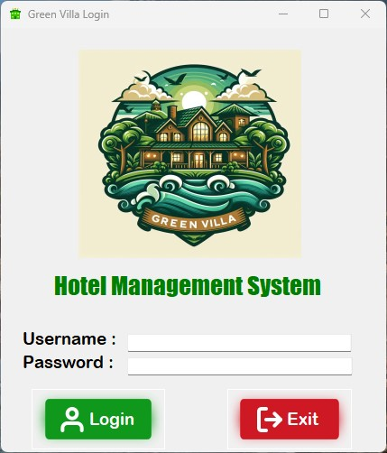
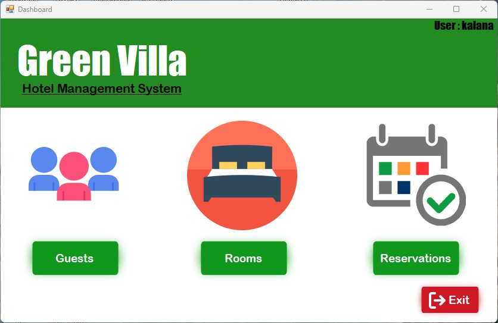
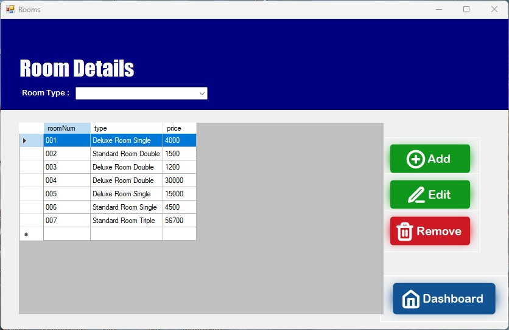

# Green Villa Hotel Management System

 * This is a Hotel Management System Made for a fictional hotel called 'Green Villa' written in C# and SQL.
   
 * This app can be used to manage rooms, guest details and reservations.

## Screenshots
 ### Login
   
 ### Dashboard
   
 ### Menu
   
   
## SETUP

* Download .
* Or you can use Microsoft Visual Studio to open the project.
  
* Create the database. The required database can be created using SQL commands similar to the example code below.
  ```
    CREATE DATABASE greenvilla;
    USE greenvilla;
    CREATE TABLE employee (
        E_ID         INT PRIMARY KEY,
        name       VARCHAR(20),
        NIC        VARCHAR(12),
        username   VARCHAR(20),
        passwd     VARCHAR(20)
    );
    
    INSERT INTO employee (E_ID,Name,NIC,Username,Passwd) 
    VALUES (001,'S.G.T. Perera',"200403300567","perera","1234"),
           (002,'S.H.J.I. Silva',"9767875234V","silva","1234");
    
    CREATE TABLE guest (
        G_ID      INT PRIMARY kEY AUTO_INCREMENT,
        name      VARCHAR(50),
        NIC       VARCHAR(12),
        email     VARCHAR(30),
        tp        VARCHAR(15)
    );
    
    CREATE TABLE room (
        roomNum   VARCHAR(5) PRIMARY kEY,
        type      VARCHAR(50),
        price     INT
    );
    
    CREATE TABLE reservation (
        reservationID INT PRIMARY KEY AUTO_INCREMENT,
        GID           INT,
        startDate     DATE,
        endDate       DATE,
        numberOfDays  INT,
        roomNum       VARCHAR(5),
        cost          INT   
    );

    INSERT INTO guest (name,NIC,email,tp) 
    VALUES ('W.K.I. Jayawardena',"200409876543","jayawardena@gmail.com","0789876543"),
	     ('S.G.K. Bandara',"67897656V","bandara@gmail.com","0781234534"),
	     ('A.B.C. Gamage',"200434567784","gamage@gmail.com","0756789012"),
	     ('D.E.F. Perera',"200564534543","perera@gmail.com","0756786762");
  ```
* You must add the correct servername, username, password, tablename in the 'Connection.cs' file to properly connect to the database.


